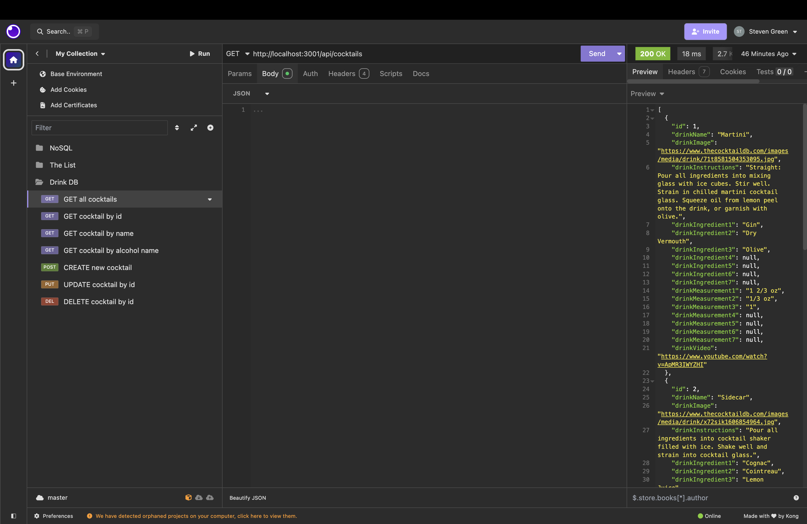

# drink-db

## Description
A cocktail database using postresSQL, Sequalize, and express. Setup GET, POST , PUT, and DELETE routes. Setup GET routes for All, Cocktail by id, Cocktail by name, and Cocktail by alcohol. Tested routes usting Insomnia.

## Table of contents
- [Mock-up](#Mock-up)
- [Installation](#Installation)
- [Usage](#Usage)
- [Contribution](#Contributing)
- [Test](#Test)
- [Links](#Link)

## Mock-up

## Installation
pg

sequelize

express

dotenv

## Usage
\i schema.sql (In db file)

npm i

npm run seed

npm start

## Contributing
Steven Green

## Test
Insomnia

## Link
GitHub Repo: https://github.com/mrgreen12375/drink-db